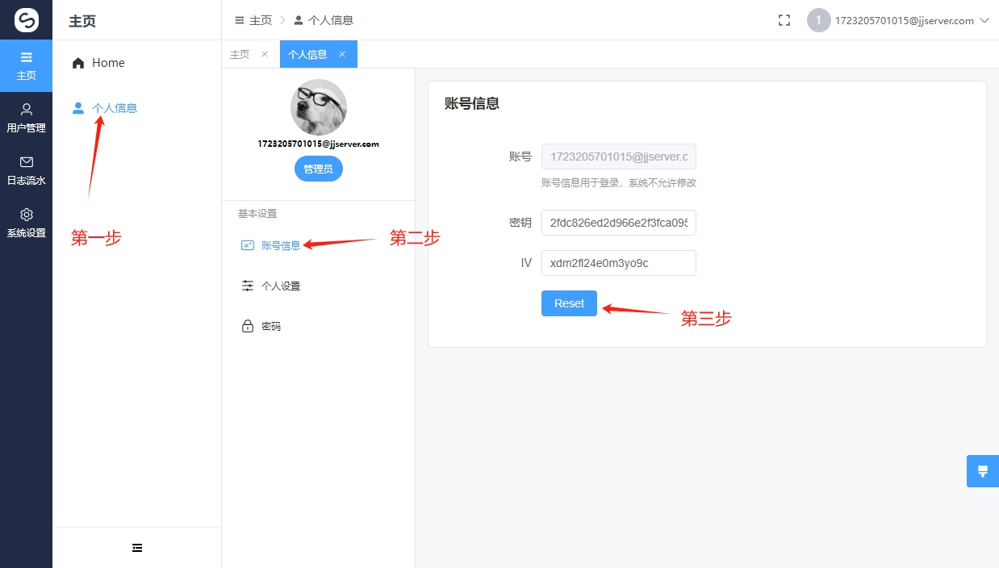

# 修改密钥

<figure><figcaption></figcaption></figure>


修改密钥也就是Key跟IV非输入模式,点击<mark style="color:blue;">Reset</mark>会重新分配一个对应的密钥跟IV 改用处用于后面API的对接使用,用来传输用户的钱包以及代理的一些信息非明文.使用<mark style="color:red;">AES-128-CBC</mark>加密

